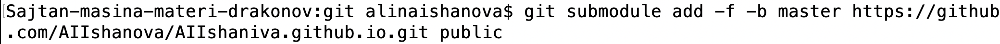

## Задание

- Размещение на Github заготовки для персонального сайта
- Установка фотографии владельца сайта
- Установка описания владельца сайта

## Выполнение

### Размещение сайта на github

1. Организация рабочего пространства (команда mkdir). (рис.2.1 и рис.2.2)

{ #fig1:1 width=100% }

{ #fig1:1 width=100% }

2. Создаем директорию blog (mkdir), переходим в нее (cd) и скачиваем туда шаблон нашего будущего сайта (git clone). (рис.2.3)

{ #fig1:1 width=100% }

3. Запускаем hugo (hugo). (рис.2.4)

{ #fig1:1 width=100% }

4. Удаляем ненужные файлы (rm). (рис.2.5)

{ #fig1:1 width=100% }

5. Инициализируем git (git init), коммитим (git add . и git commit). (рис.2.6)

{ #fig1:1 width=100% }

6. Создаем репизитории н для сайта на github. (рис.2.7)

{ #fig1:1 width=100% }

7. Выкладываем репозиторий на github (remote add origin, push). (рис.2.8)

{ #fig1:1 width=100% }

8. Создание подмодуля (git submodule add). (рис.2.9)

{ #fig1:1 width=100% }

9. Добавляем все в локальный репозиторий git и отправляем его в удаленный репозиторий на GitHub. (рис.2.10)

{ #fig1:1 width=100% }

10. Обновляем HTML через hugo (hugo, git add, git commit). (рис.2.11)

{ #fig1:1 width=100% }

11. Выкладываем все на github(git push). (рис.2.11)

{ #fig1:1 width=100% }

### Смена аватара владельца

Заменяем картирнку avatar.jpg на нашу с таким же наименованием в папке .../blog/git/content/authors.

### Изменение информации о пользователе

1. В папке .../blog/git/content/authors открываем файл _index.md и редактируем его.

{ #fig1:1 width=100% }

2. Обновляем наш сайт через hugo и github (hugo, git add, git commit).

{ #fig1:1 width=100% }

{ #fig1:1 width=100% }

## Результат

{ #fig1:1 width=100% }
