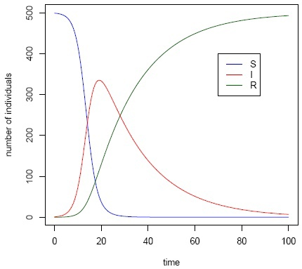
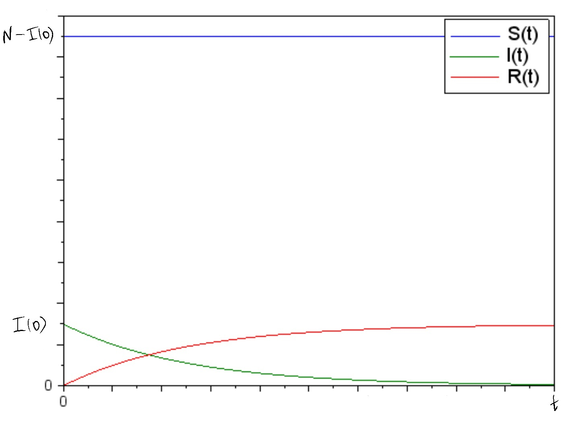

Co-authors: Smorodova D., Shutenko V., Surtzov S. and Firtsov I.

## Модель

### Модель $SIR$

- Компартментная

- $S \rightarrow I \rightarrow R$, где $S$ - число  особей, восприимчивых к болезни

- Переменные  $S, I, R$  кол-во людей в каждой группе в определенное время/состояние системы, следовательно они функции от времени $S(t), I(t), R(t)$

- Система задается:
  - $N -$ число особей в популяции
  - $S(0) -$ число восприимчивых к болезни особей на момент начала эпидемии
  - $I(0) -$ число инфицированных особей на момент начала эпидемии
  - По умолчанию $R(0)=0$, $R(0) -$ число особей с иммунитетом к болезни на момент начала эпидемии
  - $I^* -$  критическое значение заболевших

## Описание системы (уравнения)

### Система 1. Скорость изменения числа особей, восприимчивых к болезни

$$\frac{dS}{dt} = \begin{cases} -\alpha S, I(t) > I^* \\ 0, I(t) \leq I^*\end{cases} $$

- $S -$ число  особей, восприимчивых к болезни

- $\alpha$ - коэффициент заболеваемости

- $I(t) -$ число инфицированных особей  в момент времени  $t$

- $I^* -$ критическое значение заболевших

### Система 2. Скорость изменения числа инфекцированных особей

$$\frac{dI}{dt} = \begin{cases} \alpha S - \beta I, I(t) > I^* \\ - \beta I, I(t) \leq I^*\end{cases} $$

- $S -$ число  особей, восприимчивых к болезни

- $\alpha$ - коэффициент заболеваемости

- $\beta$ - коэффициент выздоровления

- $I(t) -$ число инфицированных особей  в момент времени  $t$

- $I^* -$ критическое значение заболевших

### Уравнение скорости изменения выздоравливающих особей

$$\frac{dR}{dt} = \beta I $$

- $\beta$ - коэффициент выздоровления

- $I -$ число инфицированных особей

### Уравнение при условии закрытия границ города

$$ I(t) + S(t) + R(t) = const = N $$

- $I(t) -$ число инфицированных особей  в момент времени  $t$

- $S(t) -$ число восприимчивых к болезни особей в момент времени  $t$

- $S(t) -$ число особей с иммунитетом к болезни в момент времени  $t$

- $N -$ число жителей города

## Исследование модели

{ #fig1: width=80% }

### Особые случаи

- $I(t) < I^*$, $R(t)\uparrow$ при $t\uparrow$ и $S(t)=const$ при $\forall t$

{ #fig1: width=80% }

- Параметр $\alpha$ - коэффициент заболеваемости влияет на то, как быстро произойдет пик количества заболевших (чем больше $\alpha$, тем раньше пик, а чем раньше пик, тем он больше, так как меньше людей с иммунитетом)

- $\alpha=0$
  - $S(t)=const=S(0)$ $\Rightarrow$ $\frac{dI}{dt}<0$ при $\forall t$
  - $-\frac{dI}{dt}=\frac{dR}{dt}$
  - $|\frac{dI}{dt}|\downarrow$ при $t\uparrow$

- $\alpha=1$
  - мгновенный пик количества заболевших
  - $\lim_{t\to0^+}S(t)=0$
  - $\lim_{t\to0^+}I(t)=N$
  - и затем сразу же $-\frac{dI}{dt}=\frac{dR}{dt}$, $|\frac{dI}{dt}|\downarrow$ при $t\uparrow$

- Параметр $\beta$ - коэффициент выздоровления влияет на то, как быстро количество зараженных/больных стремиться к нулю
  
- $\beta=0$
  - $R(t)=const=0$
  - $I(t)\rightarrow N$, $S(t)\rightarrow 0$
  - $I(\infty)=const=N$

- $\beta=1$
  - мгновенное исцеление
  - $\lim_{t\to0^+}I(t)=0$
  - $\lim_{t\to0^+}R(t)=I(0)$

### Анализ

1. $\alpha<\beta$
    - при $S \leq 2I$ выздоравливают быстрее чем заражаются $\Rightarrow$ эпидемия затухает
    - при $S > 2I$ заражаются быстрее чем выздоравливают $\Rightarrow$ эпидемия разгорается
2. $\alpha>\beta$
    - при $S \geq 2I$ заражаются быстрее чем выздоравливают $\Rightarrow$ эпидемия разгорается
    - при $S < 2I$ выздоравливают быстрее чем заражаются $\Rightarrow$ эпидемия затухает
3. $\alpha=\beta$
    - при $S > 2I$ заражаются быстрее чем выздоравливают $\Rightarrow$ эпидемия разгорается
    - при $S < 2I$ выздоравливают быстрее чем заражаются $\Rightarrow$ эпидемия затухает
    - при $S = 2I$ $\Rightarrow$ $\frac{dI}{dt}=\frac{dR}{dt}$ и $\frac{dR}{dt} \geq 0$ $\forall t$ $\Rightarrow$ $\frac{dI}{dt} \geq 0$ $\Rightarrow$ состояние невозможно поддерживать, так как $\frac{dS}{dt} \leq 0$ $\forall t$

### Ассимтотические исследования

- Так как в нашей модели отсутсвует повторная заболеваемость, то чем дольше длиться эпидемия
  - $R(t)\uparrow$ и $S(t)\downarrow$ $\Rightarrow$ $I(t)\downarrow$
  - Причем, при длительной эпидемии пик количества заболевших пройден, а следовательно $\frac{dI}{dt}<0$ и $|\frac{dI}{dt}|\downarrow$
  - А если $I(t)\downarrow$ то $\frac{dR}{dt}\downarrow$
  - Таким образом $I(\infty) \rightarrow 0$ и $R(\infty) \rightarrow N$ $\Rightarrow$ $S(\infty)\rightarrow 0$

## Задача

### Случай а) начальное число зараженных/болеющих меньше критического

Известно, что из всех проживающих в городе $(N=10000)$ в момент начала эпидемии $(t=0)$ число заболевших испанкой людей (являющихся распространителями инфекции) $I(0)= 20$, А число здоровых людей с иммунитетом к болезни $R(0)=0$. Таким образом, число людей восприимчивых к болезни, но пока здоровых, в начальный момент времени $S(0) = N-I(0)= 9980$. Считаем, что после выявления болезни, город сразу же закрыли. При этом коэффициент заболеваемости $\alpha$ = 0.1, а коэффициент выздоровления $\beta$ = 0.05.

### Случай б) начальное число зараженных/болеющих больше критического

Известно, что из всех проживающих в городе $(N=10000)$ в момент начала эпидемии $(t=0)$ число заболевших испанкой людей (являющихся распространителями инфекции) $I(0)= 3000$, А число здоровых людей с иммунитетом к болезни $R(0)=0$. Таким образом, число людей восприимчивых к болезни, но пока здоровых, в начальный момент времени
$S(0)=N-I(0)=7000$. Считаем, что после выявления болезни, город сразу же закрыли. При этом коэффициент заболеваемости $\alpha$ = 0.1, а коэффициент выздоровления $\beta$ = 0.05.

### Система в условиях нашей задачи

$$\frac{dS}{dt} = \begin{cases} - 0.1 * S, I(t) > I^* \\ 0, I(t) \leq I^*\end{cases} $$

- $S -$ число  особей, восприимчивых к болезни

- $I(t) -$ число инфицированных особей  в момент времени  $t$

- $I^* -$ критическое значение заболевших

$$\frac{dI}{dt} = \begin{cases} - 0.1 * S - 0.05 * I, I(t) > I^* \\ - 0.05 * I, I(t) \leq I^*\end{cases} $$

- $S -$ число  особей, восприимчивых к болезни

- $I(t) -$ число инфицированных особей  в момент времени  $t$

- $I^* -$ критическое значение заболевших

$$\frac{dR}{dt} = 0.05 * I $$

- $I -$ число инфицированных особей

$$ I(t) + S(t) + R(t) = const = N = 10000 $$

- $I(t) -$ число инфицированных особей  в момент времени  $t$

- $S(t) -$ число восприимчивых к болезни особей в момент времени  $t$

- $S(t) -$ число особей с иммунитетом к болезни в момент времени  $t$

- $N -$ число жителей города

## Библиография

1. Compartmental models in epidemiology - https://en.wikipedia.org/wiki/Compartmental_models_in_epidemiology
2. *А.В. Гаврилина , С.В. Соколов* - Анализ SIR-модели распространения заболеваний, pp 229-232, 2018.
